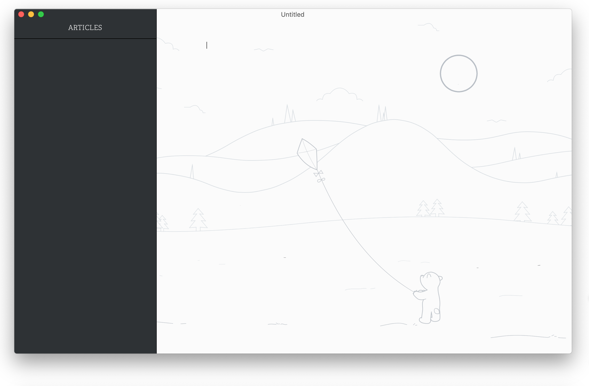
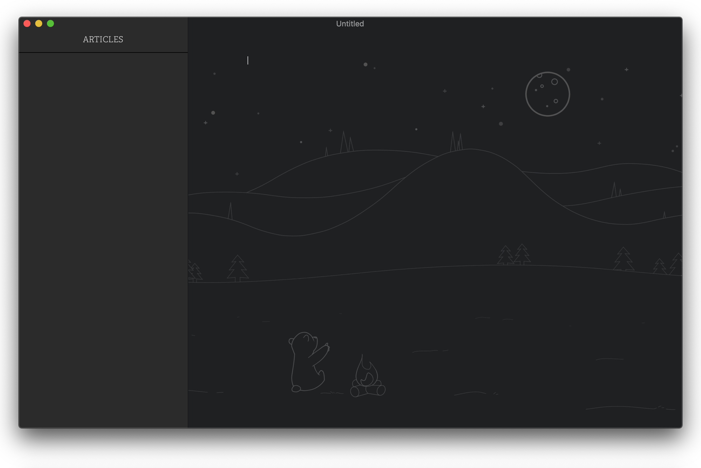

# Ursine


A theme for the wonderful [Typora](https://typora.io), inspired by [Bear](https://bear.app)'s colors and elegancy.


Uses *Avenir Next LT Pro* and *Adelle* fonts, & the colors are based on Bear's *Red Graphite* and *Dark Graphite* themes.

Code fence themes are adapted from CodeMirror's *3024 Day* and *Dracula* themes for Ursine Polar and Umbra, respectively.

> Note: These themes have been designed and tested for both **MacOS & Windows** (though primarily Mac).

## Installation

Decompress the latest release from [here](https://github.com/aCluelessDanny/typora-theme-ursine/releases). In Typora's preferences windows, go to `General -> Themes` and click on `Open Theme Folder`. Drop all the decompressed files and folders in there, and enjoy!~

#### Which one should I download?

There are 3 different "packs" that you can download. The only thing that differentiates between them is the fonts they use.

- `Ursine.zip`: This is usually the one you want to download, as it has the base fonts shown in the pictures. Try this one first if you're unsure.
- `Ursine_Cyrillic.zip`: These fonts are a direct variation of the base fonts above, & they offer the exact same look as shown in the pictures. Download this one if you require Cyrillic fonts.
- `Ursine_Alt.zip`: These fonts are _similar_ to the ones mentioned above, but they are compatible with more languages, including Greek, Viatnamese, & Cyrillic. Use this if you need that language support.
  - These alternative fonts are [Roboto Slab](https://fonts.google.com/specimen/Roboto+Slab) for headers and quotes, & [Open Sans](https://fonts.google.com/specimen/Open+Sans) for paragraph text.

*Note:* If you require using Cyrillic-compatible fonts, then download the Cyrillic variant found in the release instead.

### Like the theme a lot?

I slightly debated on this, and hey, I don't see why not. If you find this theme really useful and you're feeling super generous, *how 'bout donating a coffee?*

Ever since publishing this theme, I've periodically refined it overtime through the issues on my free time (and I *maaay* have spent a bit too much time on this during some of my classes back then).

So if you wanna show appreciation that way, just know that this college boy would appreciate that generosity greatly~

[](https://ko-fi.com/clueless)

## Preview

<details>
<summary>Ursine Polar</summary>




</details>

<details>
<summary>Ursine Umbra</summary>




</details>

## Build

Ursine has recently switched to developing in [Sass](https://sass-lang.com/) and [Gulp.js](https://gulpjs.com/), so the repo no longer holds the direct CSS files for the sake of keeping the repo's filetree clean.

If you wish to manually build the theme (and maybe add your own touches in the process), you'll need `npm` & run the following commands:

```bash
npm i
gulp
```

The compiled CSS files will be located in the `/dist` directory once complete.

Three is also a `dev` script that will watch the files and assets & update your themes in your themes folder directly as you save your changes. Simply run `gulp dev` to do so (and remember to reselect the theme in Typora afterwards to see the changes). Note that this currently only works on **MacOS and Windows only** (I'll add Linux support once someone requests it because I have no idea where the theme is saved in that one).

### Related

- If you like Ursine, but need a `RTL` theme, check out [sadra's Middle East theme!](https://github.com/sadra/middle-east)
