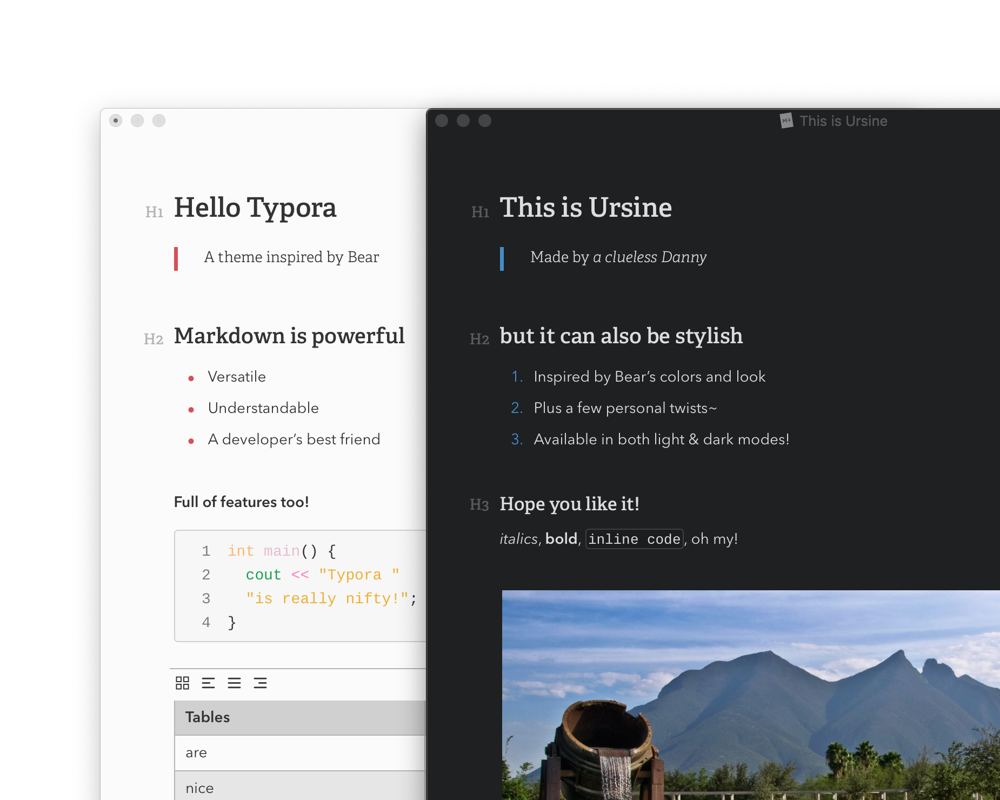

# Ursine

A theme for the wonderful [Typora](https://typora.io), inspired by [Bear](https://bear.app)'s colors and elegancy.

Uses *Avenir Next LT Pro* and *Adelle* fonts, & the colors are based on Bear's *Red Graphite* and *Dark Graphite* themes.

Code fence themes are adapted from CodeMirror's *3024 Day* and *Dracula* themes for Ursine Polar and Umbra, respectively.

> Note: These themes have been designed and tested on **MacOS** and *partially on Windows*. They have not been fully tested, but they should theoretically work fine for Windows and Linux.

> *Now with unibody styling!*

## Installation

Decompress the latest release from [here](https://github.com/aCluelessDanny/typora-theme-ursine/releases). In Typora's preferences windows, go to `General -> Themes` and click on `Open Theme Folder`. Drop all the decompressed files and folders in there, and enjoy!~

## Ursine Polar

## Ursine Umbra

